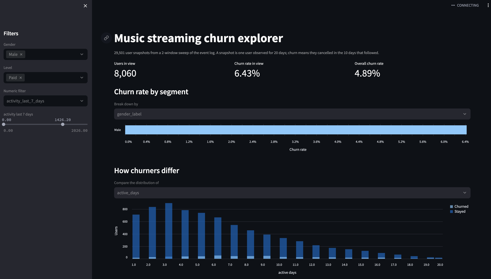

# Music streaming churn explorer

An interactive Streamlit app for exploring which users of a music streaming
service are about to cancel, built from raw event logs, tested in CI and
packaged as a Docker image.

## The problem

The service records one row per user action: playing a song, a thumbs up or
down, an advert, an error, a logout, a cancellation. A user has churned the
moment their log contains a `Cancellation Confirmation`, and nobody comes
back, so churn is terminal.

Two things make it awkward. The signal lives in behaviour over time rather
than in any single row, so weeks of events have to be summarised into one
vector per user. And churn is rare, around 5% of active users in a given
window, so accuracy is meaningless.

## From event log to feature table

`src/data_extractor.py` slides two windows over the timeline:

1. An **observation window** of 20 days. Every user still active at the end
   of it becomes one row, described by features summarising those 20 days.
   Users who cancel *inside* the window are dropped, because the point is to
   predict churn for users who are still around.
2. A **prediction window** of 10 days immediately after. The label is 1 if
   the user cancels during it.

Sliding that pair to two positions on the calendar gives two snapshots of
the population, which roughly doubles the data while keeping every row a
genuine predict-the-future case. One user can therefore appear twice, once
per snapshot; the `window` column records which.

Features cover profile, core activity, engagement and frustration, recency
and session shape, the last seven days as a trend, and day-to-day
volatility.

## Architecture

The raw log is 17.5 million rows and 567 MB, so it is not in this
repository and the app never reads it. A one-off script turns it into a
small per-user table:

    data/train.parquet   →  scripts/build_features.py  →  data/features.parquet
    (567 MB, not tracked)                                 (small, committed)

The app reads only `features.parquet`, which is why it starts instantly and
why the container needs nothing external.

## Run it locally

    python3.11 -m venv .venv
    source .venv/bin/activate
    python -m pip install -r requirements.txt
    streamlit run app.py

Then open http://localhost:8501

## Run it with Docker

    docker build -t churn-streamlit:1.0 .
    docker run -d -p 8501:8501 --name churn churn-streamlit:1.0

## Rebuild the features from the raw log

Only needed if you want to change the windows or the feature set. Put
`train.parquet` in `data/` (see [`data/README.md`](data/README.md)), then:

    python -m scripts.build_features

The module form matters: running the file directly puts `scripts/` on the
import path instead of the project root and the `src` imports fail.

## Run the tests

    python -m pip install pytest
    python -m pytest -v

## Project structure

    app.py                      Streamlit UI only, no data logic
    src/data_extractor.py       Sliding windows and feature engineering
    src/data_loader.py          Reading, validating, label handling
    src/filters.py              Filtering and summarising
    scripts/build_features.py   Raw log to feature table, run once
    tests/                      Unit tests for all three src modules
    data/features.parquet       The engineered table, committed
    Dockerfile                  Container definition
    .github/workflows/ci.yml    Tests, then an image build

Everything in `src/` is a pure function with no Streamlit import anywhere,
which is what makes it unit testable. `app.py` holds no data logic at all.

## Tests

The suite covers the data importing and filtering functions:

**Windowing and labelling**, against a synthetic event log with three users
whose fates are known by construction: only in-window events are kept, a
user who cancels inside the observation window is dropped, a user who
cancels in the prediction window is labelled 1, no NaN survives, event
counts match the window exactly, and profile features are encoded as
expected.

**Loading**: reader dispatch by extension, column subsetting, unsupported
extension and missing file both raising, required-column validation naming
what was found, label coercion rejecting anything that is not 0 or 1.

**Filtering**: an empty selection as a no-op, empty results, unknown
columns, inclusive boundaries, an inverted range rejected, churn rate on an
empty frame, group ordering, and filters never mutating their input.

Most tests build small frames inline, so they run in milliseconds and
describe the contract rather than the dataset.

## Reproducibility

- **Pinned dependencies.** `requirements.txt` pins exact versions,
  generated with `pip freeze` from a working environment rather than
  written by hand.
- **Pinned base image.** `python:3.11-slim`, matching the Python the app was
  developed and tested against.
- **The engineered data is committed, the raw log is not.** Everyone runs
  against identical bytes, with no dependency on an external host, and the
  repository stays inside GitHub's limits. `build_features.py` regenerates
  the table deterministically from fixed window dates.
- **Only eight of nineteen raw columns are ever read.** That is a large
  memory saving, and it means names, locations and user agents never reach
  the feature table or the image.
- **Test dependencies kept separate.** `pytest` is not in
  `requirements.txt`, so it does not ship in the production image. CI
  installs it explicitly.
- **CI as proof.** Every push runs the tests on a clean Ubuntu machine,
  which is the only real defence against works on my machine. The image
  build runs only after the tests pass.
- **No credentials and no network calls at runtime.** The container is
  self-contained and runs offline.

## Data

Course material from the *Python for Data Science* RAMP challenge, not
redistributed here. See [`data/README.md`](data/README.md) for the expected
filename and the raw schema.

## Author

Korouhanba Laikhuram, DSAIB, École Polytechnique and HEC Paris.